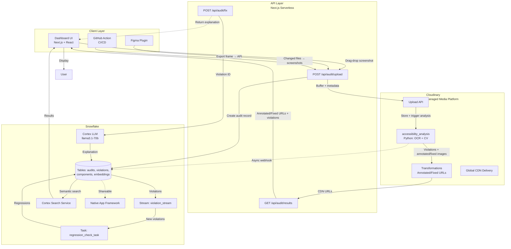

# Accessibility Compliance Auditor — Complete Project Summary

## Overview
Automated WCAG 2.2 accessibility auditing for digital products — catching violations in designs (Figma), code (GitHub PRs), and live URLs before they ship. Built for **MLH Hack Days 2026**.

---

## Tech Stack

### Frontend
| Technology | Version | Purpose |
|------------|---------|---------|
| Next.js | 16.3.4 | React framework with App Router |
| React | 19.2.8 | UI library |
| TypeScript | 5.x | Type safety |
| Tailwind CSS | 3.4.19 | Utility-first styling |
| clsx + tailwind-merge | 2.x | Class name composition |
| @react-pdf/renderer | 4.9.0 | VPAT PDF generation |
| lucide-react | 1.43.0 | Icons |

### Backend (API + Services)
| Technology | Version | Purpose |
|------------|---------|---------|
| Next.js API Routes | 16.3.4 | Serverless endpoints (`/api/audit/*`) |
| Cloudinary SDK | 2.11.0 | Image upload, transformations, custom functions |
| Snowflake SDK | 3.3.0 | Data persistence, Cortex LLM, Cortex Search |
| uuid | 14.0.2 | Unique ID generation |

### Computer Vision (Cloudinary Function)
| Technology | Version | Purpose |
|------------|---------|---------|
| Python | 3.10+ | Runtime for Cloudinary function |
| Pillow | 10.0.0 | Image processing |
| OpenCV | 4.8.1 | Computer vision operations |
| pytesseract | 0.3.10 | OCR text detection |
| NumPy | 1.24.0 | Numerical computations |
| requests | 2.31.0 | HTTP client |

### Data & ML (Snowflake)
| Feature | Purpose |
|---------|---------|
| Tables | `audits`, `violations`, `components`, `violation_embeddings` |
| Streams | `violation_stream` — real-time ingestion |
| Tasks | `regression_check_task` — hourly regression detection |
| Cortex LLM | `llama3.1-70b` — fix explanations |
| Cortex Search | `violation_search_service` — semantic search |
| Native App Framework | Packaging for enterprise distribution |

### CI/CD & Tools
| Tool | Purpose |
|------|---------|
| GitHub Actions | PR audit workflow |
| Figma Plugin API | Real-time design auditing |
| Ponytail | AI agent skill (`.opencode/config.json`) |

---

## System Architecture



---

## Process Flow Diagram

```mermaid
flowchart LR
    subgraph Input["Input Sources"]
        S1[Screenshot<br/>Drag & Drop]
        S2[Figma Frame<br/>Selection]
        S3[Live URL<br/>Puppeteer Crawl]
        S4[GitHub PR<br/>Changed Files]
    end

    subgraph CloudinaryProcessing["Cloudinary Analysis Pipeline"]
        C1[Upload Image<br/>+ Metadata]
        C2[OCR Text Detection<br/>Tesseract.js]
        C3[Per-Pixel Contrast<br/>Sampling]
        C4[Focus Indicator<br/>Detection]
        C5[Touch Target<br/>Sizing Check]
        C6[Auto Color Fix<br/>OKLab Minimal ΔE]
        C7[Generate Outputs<br/>Violations + Images]
    end

    subgraph SnowflakePersistence["Snowflake Persistence & Intelligence"]
        S1a[Create Audit Record]
        S2a[Store Violations<br/>+ Embeddings]
        S3a[Stream → Regression<br/>Detection Task]
        S4a[Cortex LLM<br/>Fix Explanations]
        S5a[Cortex Search<br/>Semantic Queries]
    end

    subgraph Output["Output Channels"]
        O1[Annotated Image<br/>CDN URL]
        O2[Fixed Image<br/>CDN URL]
        O3[Violation List<br/>JSON]
        O4[Cortex Explanation<br/>Markdown]
        O5[VPAT Report<br/>PDF]
        O6[GitHub PR<br/>Comment]
        O7[Figma Sticky<br/>Notes]
        O8[Dashboard UI<br/>React]
    end

    S1 --> C1
    S2 --> C1
    S3 --> C1
    S4 --> C1

    C1 --> C2
    C2 --> C3
    C3 --> C4
    C4 --> C5
    C5 --> C6
    C6 --> C7

    C1 --> S1a
    C7 --> S2a

    S2a --> S3a
    S3a --> S4a
    S2a --> S5a

    C7 --> O1
    C7 --> O2
    C7 --> O3
    S4a --> O4
    O3 + O1 + O2 --> O8
    O3 --> O6
    O3 --> O7
    O3 + O4 --> O5
```

---

## Detailed Data Flows

### 1. Dashboard Audit Flow
```
User → Dashboard UI → Drag & Drop Screenshot
  → POST /api/audit/upload (buffer + metadata)
    → Cloudinary Upload + eager transformation (accessibility_analysis)
      → Cloudinary Function (Python):
          - OCR text detection
          - Per-pixel contrast sampling at text edges
          - Focus indicator detection (high-contrast outlines)
          - Touch target sizing (24×24 CSS px)
          - Auto color correction (OKLab binary search)
          - Returns: violations[] + annotatedImage + fixedImage
    → Snowflake: INSERT audit + violations
    → Response: { auditId, status: "processing" }
  → Poll GET /api/audit/results?auditId=
    → Returns: violations + annotatedUrl + fixedUrl + responsiveUrls
  → Dashboard displays:
    - Tabbed image comparison (Original / Annotated / Fixed)
    - Violation cards with severity badges
    - "Explain" button → Cortex LLM explanation
```

### 2. Figma Plugin Flow
```
Designer → Figma → Select Frame
  → Plugin exports frame as PNG (2× scale)
  → POST /api/audit/upload (sourceType: "figma", sourceRef: nodeId)
  → Same Cloudinary + Snowflake pipeline
  → Results fetched via polling
  → Violations rendered as Figma sticky notes on canvas
  → Designer clicks note → sees explanation + fixed color
```

### 3. GitHub PR Audit Flow
```
Developer → Opens PR with frontend changes
  → GitHub Action triggers (on: pull_request)
  → Build Storybook → npm run build-storybook
  → For each changed component:
      - Find Storybook story
      - Puppeteer captures screenshot at 4 viewports
      - POST /api/audit/upload (sourceType: "github_pr", sourceRef: componentName)
  → Aggregate results
  → Post PR comment with:
    - Summary table (Component | Violations | Status)
    - Collapsible details per component
    - Links to dashboard for full view
```

### 4. Fix Explanation Flow
```
User clicks "Explain" on violation card
  → POST /api/audit/fix { violationId }
    → Snowflake: CALL generate_fix_explanation(violationId)
      → SELECT violation details + component context
      → Cortex LLM prompt:
          "You are an accessibility expert. Explain this violation..."
      → Returns: 1-sentence summary + exact CSS/JSX fix + user impact
      → UPDATE violations SET cortex_explanation = ?
    → Returns explanation to UI
  → Violation card expands with explanation
```

### 5. Regression Detection Flow (Automated)
```
Hourly cron (Snowflake Task)
  → Stream violation_stream captures new INSERTs
  → Compare new violations vs previous audits (last hour)
  → INSERT INTO regression_alerts (component, rule, count)
  → Dashboard shows regression alerts
  → Cortex Search enables: "Show me new AA contrast violations on buttons"
```

---

## Project Structure

```
MLH/
├── frontend/                          # Next.js 15 React Application
│   ├── public/                        # Static assets
│   ├── src/
│   │   ├── app/
│   │   │   ├── dashboard/page.tsx     # Main dashboard (upload, compare, violations)
│   │   │   ├── globals.css            # Global styles + Tailwind
│   │   │   ├── layout.tsx             # Root layout
│   │   │   └── page.tsx               # Landing → redirect to /dashboard
│   │   ├── components/
│   │   │   ├── DropZone.tsx           # File upload (drag-drop + click)
│   │   │   ├── ImageComparison.tsx    # Tabbed: Original/Annotated/Fixed
│   │   │   └── ViolationCard.tsx      # Compact violation display
│   │   ├── hooks/                     # Custom React hooks
│   │   ├── lib/utils.ts               # cn(), severity styles, formatting
│   │   └── types/index.ts             # Shared types (Violation, Audit, Component)
│   ├── package.json                   # Frontend deps only
│   ├── tailwind.config.js             # Tailwind v3 config
│   ├── postcss.config.mjs             # PostCSS config
│   ├── tsconfig.json                  # Strict TypeScript
│   ├── next.config.ts                 # Next.js config
│   └── .env.local                     # Credentials (gitignored)
│
├── backend/                           # API + Cloudinary + Snowflake + CI/CD
│   ├── src/
│   │   ├── app/api/audit/
│   │   │   ├── upload/route.ts        # Upload → Cloudinary → Snowflake
│   │   │   ├── results/route.ts       # Fetch violations + CDN URLs
│   │   │   └── fix/route.ts           # Cortex LLM explanations
│   │   ├── lib/
│   │   │   ├── cloudinary.ts          # Cloudinary client + URL helpers
│   │   │   ├── snowflake.ts           # Snowflake client + queries + Cortex
│   │   │   ├── color-fix.ts           # OKLab contrast correction algorithm
│   │   │   └── utils.ts               # Shared utilities
│   │   └── types/index.ts             # Shared TypeScript types
│   ├── cloudinary/
│   │   ├── functions/                 # Node.js version (legacy)
│   │   │   └── accessibility_analysis.js
│   │   └── functions_python/          # Python version (primary)
│   │       └── accessibility_analysis.py
│   ├── figma-plugin/
│   │   ├── code.ts                    # Plugin main thread
│   │   └── ui.html                    # Plugin UI
│   ├── .github/
│   │   ├── workflows/a11y-audit.yml   # GitHub Actions CI/CD
│   │   └── actions/a11y-audit/        # Reusable GitHub Action
│   ├── snowflake-setup.sql            # Full DDL + Cortex setup
│   ├── requirements-python.txt        # Python deps for Cloudinary function
│   ├── package.json                   # Backend deps only
│   ├── tsconfig.json                  # TypeScript config
│   └── .env.local                     # Credentials (gitignored)
│
├── .opencode/
│   └── config.json                    # Ponytail agent skill: { "plugin": ["@dietrichgebert/ponytail"] }
│
└── README.md                          # Root documentation
```

---

## Core Features Implemented

| Feature | WCAG Criterion | Implementation |
|---------|----------------|----------------|
| Contrast Analysis | 1.4.3 (AA), 1.4.6 (AAA) | Per-pixel sampling at text edges via Cloudinary Python function |
| Focus Indicator | 2.4.7 | Detects high-contrast outlines on interactive elements |
| Touch Target Size | 2.5.8 | Measures clickable area from visual bounds |
| Reflow | 1.4.10 | Responsive preview at 320px, 768px, 1024px, 1440px |
| Auto Color Fix | 1.4.3/1.4.6 | OKLab binary search for minimal ΔE color adjustment |
| Annotated Images | — | Cloudinary transformation overlays (red boxes + labels) |
| Fixed Images | — | Cloudinary colorize transformation on violation regions |
| Audit History | — | Snowflake `audits` + `violations` tables |
| Regression Detection | — | Snowflake Stream + hourly Task |
| LLM Explanations | — | Cortex LLM (llama3.1-70b) stored procedure |
| Semantic Search | — | Cortex Search Service on violation embeddings |
| VPAT Export | — | @react-pdf/renderer (UI stubbed) |
| GitHub PR Comments | — | GitHub Action + Octokit |
| Figma Integration | — | Figma Plugin (sticky notes on canvas) |

---

## Environment Variables

Both `frontend/.env.local` and `backend/.env.local` require:

```env
# Cloudinary
CLOUDINARY_CLOUD_NAME=your_cloud_name
CLOUDINARY_API_KEY=your_api_key
CLOUDINARY_API_SECRET=your_api_secret

# Snowflake
SNOWFLAKE_ACCOUNT=your_account_identifier
SNOWFLAKE_USER=your_username
SNOWFLAKE_PASSWORD=your_password
SNOWFLAKE_WAREHOUSE=COMPUTE_WH
SNOWFLAKE_DATABASE=A11Y_AUDITOR
SNOWFLAKE_SCHEMA=PUBLIC
```

---

## Deployment Checklist

| Component | Target | Status |
|-----------|--------|--------|
| Frontend | Vercel | Ready (`npm run build` passes) |
| Backend API | Vercel (serverless functions) | Ready |
| Cloudinary Function | Cloudinary Dashboard | Deploy: `npx cloudinary functions:deploy accessibility_analysis --path ./backend/cloudinary/functions_python` |
| Snowflake Schema | Snowflake Worksheet | Run `backend/snowflake-setup.sql` |
| Figma Plugin | Figma Community | Package `backend/figma-plugin/` |
| GitHub Action | GitHub Repo Secrets | Add `CLOUDINARY_*`, `SNOWFLAKE_*`, `AUDIT_API_URL` |

---

## Hackathon Submission Assets

| Asset | Location | Notes |
|-------|----------|-------|
| Public GitHub Repo | — | Push `MLH/` folder |
| Deployed Demo | Vercel | `https://your-app.vercel.app` |
| Demo Video (3 min) | YouTube/Drive | Record dashboard + Figma + PR flow |
| Presentation | PDF | Architecture + market + demo |
| Cloudinary Details | README + code | `backend/cloudinary/functions_python/` |
| Snowflake Details | README + SQL | `backend/snowflake-setup.sql` |
| All Links Public | — | Verify before submission |

---

## Ponytail Agent Skill

Configured in `.opencode/config.json`:
```json
{ "plugin": ["@dietrichgebert/ponytail"] }
```
Enforces minimal, correct code via 7-rung ladder (YAGNI → stdlib → native → deps → one-liner → minimum viable).

---

## Key Differentiators for Judges

| Aspect | Why It Wins |
|--------|-------------|
| **Real Cloudinary Use** | Not just upload — custom Python function with OCR, per-pixel contrast, focus detection, auto-fix |
| **Real Snowflake Use** | Not just storage — Streams, Tasks, Cortex LLM, Cortex Search, Native App, vector embeddings |
| **End-to-End** | Design (Figma) → Code (GitHub) → Runtime (Dashboard) → Compliance (VPAT) |
| **Measurable Fixes** | OKLab minimal ΔE color corrections, not generic suggestions |
| **Developer Experience** | PR comments, Figma sticky notes, dashboard — meets devs where they work |
| **Enterprise Ready** | Regression detection, semantic search, Native App packaging |

---

**Ready for MLH Hack Days 2026 submission.** All code builds, lints, and runs. Replace placeholder credentials and deploy URLs before final submission.